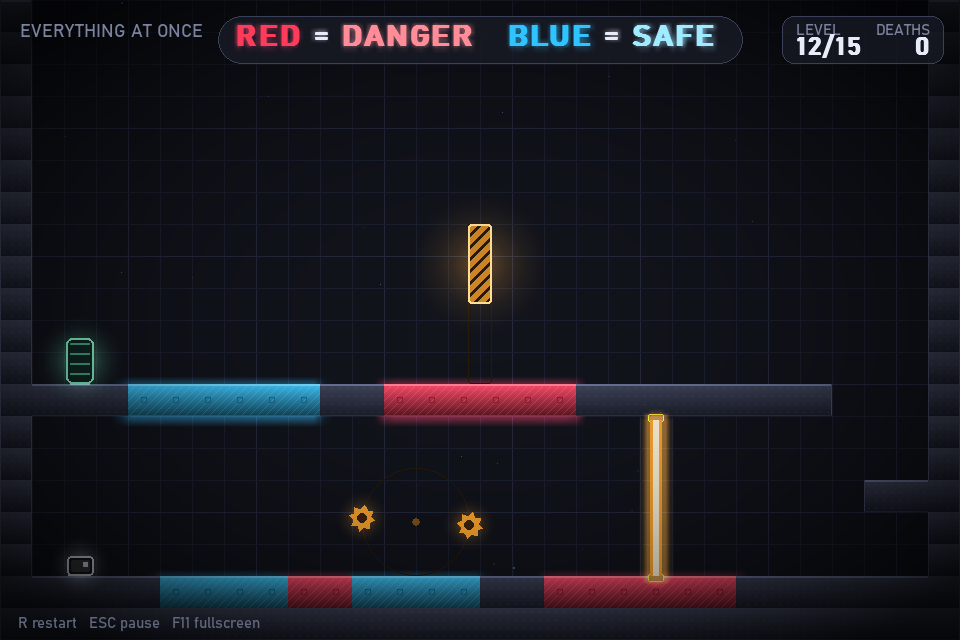

<p align="center">
  
</p>

# Chroma Lie

A deceptive 2D puzzle-platformer written in **Python + Pygame**. The screen tells you
`RED = DANGER   BLUE = SAFE`... until it doesn't.

## Run
```bash
pip install pygame          # Python 3.10+, Pygame 2.x
python main.py
```
Starts in **fullscreen** (scaled with letterboxing to fit any monitor). Press **F11** to toggle.
Resolution, colors, physics and timings live in `config.py`.

## Controls
| Key | Action |
|---|---|
| Arrow keys / A D | move |
| Space (or Up / W) | jump, hold for a higher jump |
| R | restart level |
| Esc / P | pause |
| **M** | mute / unmute |
| F11 | fullscreen on/off |

Menus work with arrows + Enter or the mouse. Progress (and the mute setting) is saved in
`chroma_lie_save.json`.

## How it plays
Reach the glowing gate. Touching anything deadly resets the level instantly.
* **Amber** things (saws, pillars, lasers, spikes) are *always* deadly.
* Red / blue / purple tiles are deadly or safe depending on the **current real rule**, which may change
  silently, with a glitch, or with a vague message. The instruction text can lie.
* Tip: the world is more honest than the words. Watch closely.

15 levels, each with its own idea: honest tutorial, narrow paths, moving hazards, silent swap,
glitch tell, timed lasers, inverted controls, double lie, unlisted purple, motion-only tiles,
lying text, full combo, fake shortcut, rule chaos, and the final collapse.

## Sound
All audio is **synthesized in memory at start-up** — no asset files, no extra dependencies.
* 7 distinct death sounds, one per cause: falling, colored tiles, saws & pillars, lasers, spikes,
  crumbling late-trap tiles, and standing still on motion tiles.
* A soft "dark lab" ambient drone loops underneath everything (its own volume knob in `config.py`).
* Jump, landing, spring pad, win jingle, and menu navigation are voiced too.
* **M** mutes/unmutes and remembers it in the save file.

## Files
| File | Role |
|---|---|
| `main.py` | loop, states (menu / select / play / pause / end), save |
| `player.py` | movement, jump (coyote time + buffer), gravity, collision |
| `level.py` | level building, moving obstacles, timed traps, platforms, `check_collisions()` |
| `levels_data.py` | the 15 levels as data (ASCII map + obstacles + rule changes) |
| `deception.py` | current rules, triggers, lies |
| `ui.py` | HUD, instruction banner, menus |
| `effects.py` | particles, glow, glitch, shake, background |
| `audio.py` | in-memory synth: SFX, 7 death sounds, ambient drone |
| `config.py` | all constants (incl. `SFX_VOLUME`, `AMBIENT_VOLUME`) |
| `tools/screenshot.py` | regenerates `screenshot.png` headless |
| `tools/smoke_audio.py` | headless audio test: synthesis, playback, mute, save round-trip |
| `tools/smoke_game.py` | headless integration test of the real game loop |

Adding a level = appending one dict to `LEVELS` in `levels_data.py` (legend at the top of that file).

## CI/CD
GitHub Actions runs everything automatically:
* **CI** (`.github/workflows/ci.yml`) — on every push to `main` and every PR: compile check +
  audio test + game-loop test + screenshot validation on a Windows/Ubuntu matrix (Python 3.10 &
  3.12), plus a `pip-audit` dependency scan.
* **Release** (`.github/workflows/release.yml`) — pushing a tag like `v1.0.0` runs the full test
  suite, builds a windowed single-file Windows exe with PyInstaller, zips it and attaches it to a
  GitHub Release with auto-generated notes.

To cut a release:
```bash
git tag v1.0.0
git push origin v1.0.0
```

---

## راهنمای فارسی (Persian)

بازی پلتفرمر-پازل فریب‌آمیز دوبعدی با **پایتون + Pygame**. صفحه به تو می‌گوید
`قرمز = خطر   آبی = امن`... تا وقتی که دیگر نگوید.

### اجرا
```bash
pip install pygame          # پایتون ۳.۱۰ به بالا، Pygame 2.x
python main.py
```
بازی **تمام‌صفحه** اجرا می‌شود (با مقیاس و نوار سیاه، روی هر مانیتوری جا می‌شود). با **F11** بین
پنجره و تمام‌صفحه جابه‌جا شو. رزولوشن، رنگ‌ها، فیزیک و زمان‌بندی‌ها همه در `config.py` هستند.

### کنترل‌ها
| کلید | کار |
|---|---|
| کلیدهای جهت / A D | حرکت |
| Space (یا Up / W) | پرش؛ نگه داشتن = پرش بلندتر |
| R | شروع دوباره‌ی مرحله |
| Esc / P | توقف |
| **M** | قطع / وصل صدا |
| F11 | تمام‌صفحه روشن/خاموش |

منوها با جهت‌ها و Enter یا با موس کار می‌کنند. پیشرفت (و وضعیت قطع صدا) در فایل
`chroma_lie_save.json` ذخیره می‌شود.

### شیوه‌ی بازی
به دروازه‌ی درخشان برس. لمس هر چیز کشنده، مرحله را فوری از نو شروع می‌کند.
* چیزهای **کهربایی** (تیغ‌ها، ستون‌ها، لیزرها، خارها) *همیشه* کشنده‌اند.
* کاشی‌های قرمز / آبی / بنفش بسته به **قانون واقعیِ فعلی** کشنده‌اند یا امن؛ قانون ممکن است بی‌صدا،
  با یک گلیچ، یا با یک پیام مبهم عوض شود. متن راهنما هم ممکن است دروغ بگوید.
* نکته: جهان صادق‌تر از حرف‌هاست. خوب نگاه کن.

۱۵ مرحله، هر کدام با یک ایده: آموزش صادق، مسیرهای باریک، خطرهای متحرک، جابه‌جایی بی‌صدا،
گلیچِ خبرده، لیزر زمان‌دار، کنترل وارونه، دروغ دوتایی، بنفشِ بی‌اسم، کاشی‌های فقط-در-حرکت،
متن دروغگو، ترکیب کامل، میان‌بُر قلابی، آشوب قوانین، و فروریزی نهایی.

### صدا
تمام صداها **در زمان اجرا و در حافظه ساخته می‌شوند** — بدون فایل صوتی، بدون وابستگی جدید.
* ۷ صدای مرگ متمایز، یکی برای هر علت: سقوط، کاشی‌های رنگی، تیغ و ستون، لیزر، خارها،
  فرو ریختن کاشی‌های تله‌ی دیرهنگام، و بی‌حرکت ماندن روی کاشی‌های motion.
* یک درانِ آرام «آزمایشگاه تاریک» زیر همه‌چیز لوپ می‌شود (ولوم جداگانه در `config.py`).
* پرش، فرود، فنر، آهنگ بردن، و ناوبری منوها هم صدا دارند.
* کلید **M** صدا را قطع/وصل می‌کند و در فایل ذخیره به یاد می‌ماند.

### فایل‌ها
| فایل | نقش |
|---|---|
| `main.py` | حلقه‌ی بازی، حالت‌ها (منو / انتخاب / بازی / توقف / پایان)، ذخیره |
| `player.py` | حرکت، پرش (coyote time + buffer)، جاذبه، برخورد |
| `level.py` | ساخت مرحله، موانع متحرک، تله‌های زمان‌دار، سکوها، `check_collisions()` |
| `levels_data.py` | ۱۵ مرحله به‌صورت داده (نقشه‌ی ASCII + موانع + تغییر قوانین) |
| `deception.py` | قوانین فعلی، تریگرها، دروغ‌ها |
| `ui.py` | HUD، بنر دستورالعمل، منوها |
| `effects.py` | ذرات، درخشش، گلیچ، لرزش، پس‌زمینه |
| `audio.py` | سنتز درون‌حافظه‌ای: افکت‌ها، ۷ صدای مرگ، دران امبیانت |
| `config.py` | همه‌ی ثابت‌ها (شامل `SFX_VOLUME` و `AMBIENT_VOLUME`) |
| `tools/screenshot.py` | بازسازی `screenshot.png` بدون پنجره |
| `tools/smoke_audio.py` | تست صدا بدون پنجره: ساخت، پخش، قطع صدا، رفت‌وبرگشت ذخیره |
| `tools/smoke_game.py` | تست یکپارچگی حلقه‌ی واقعی بازی بدون پنجره |

اضافه کردن مرحله‌ی جدید = اضافه کردن یک dict به `LEVELS` در `levels_data.py` (راهنمای نمادها
بالای همان فایل است).

### CI/CD
گیت‌هاب اکشنز همه‌چیز را خودکار انجام می‌دهد:
* **CI** (`.github/workflows/ci.yml`) — با هر پوش به `main` و هر PR: بررسی کامپایل + تست صدا +
  تست حلقه‌ی بازی + اعتبارسنجی اسکرین‌شات روی ماتریس ویندوز/اوبونتو (پایتون ۳.۱۰ و ۳.۱۲)،
  به‌علاوه اسکن امنیتی وابستگی‌ها با `pip-audit`.
* **ریلیز** (`.github/workflows/release.yml`) — پوش کردن تگی مثل `v1.0.0` کل تست‌ها را اجرا
  می‌کند، یک فایل exe تک‌فایلی و بدون کنسول ویندوز با PyInstaller می‌سازد، زیپ می‌کند و با
  یادداشت‌های خودکار به یک GitHub Release می‌چسباند.

برای گرفتن ریلیز:
```bash
git tag v1.0.0
git push origin v1.0.0
```
